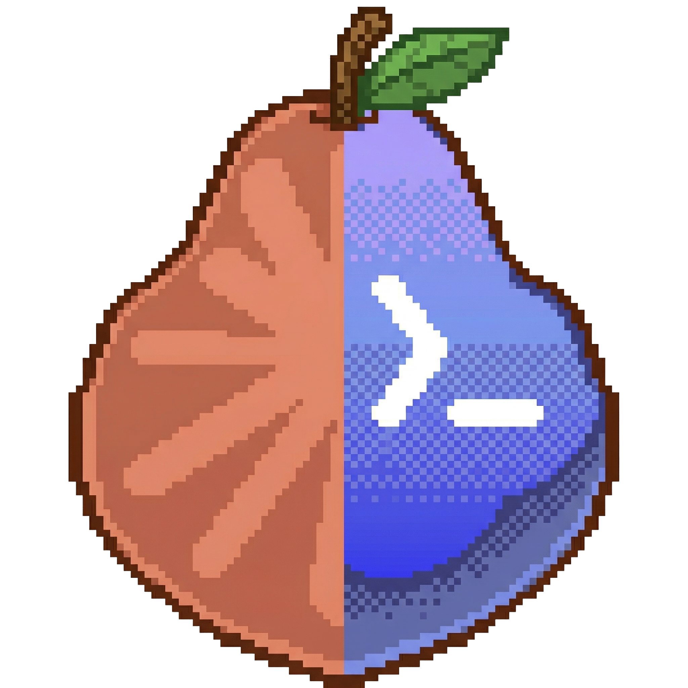
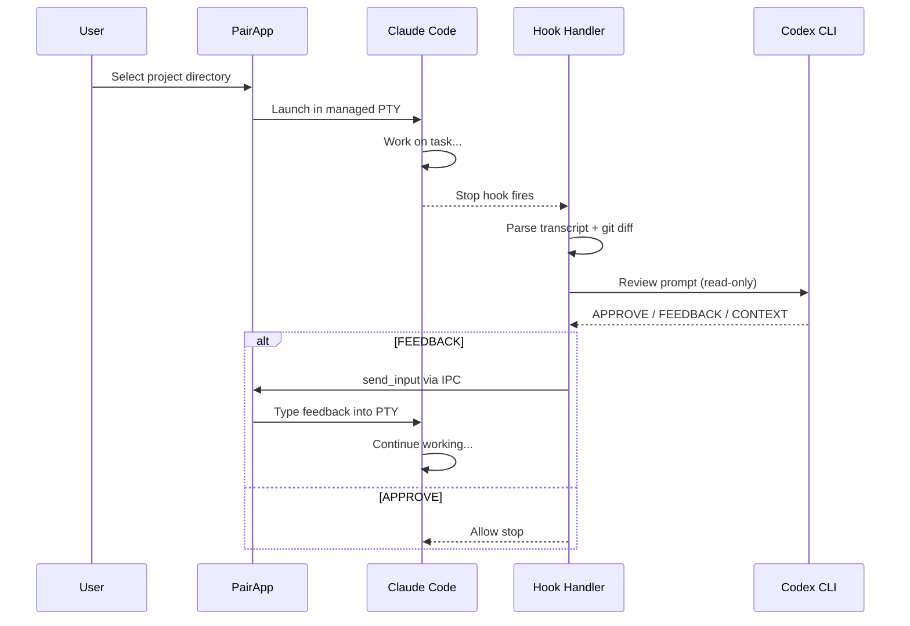
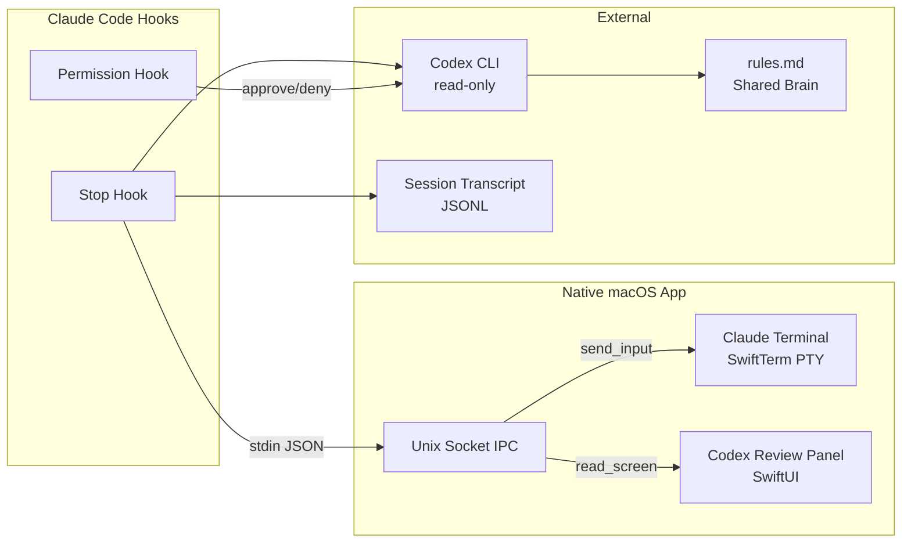

<p align="center">
  
</p>

<h1 align="center">Pair</h1>

<p align="center">
  Claude Code and OpenAI Codex, working together in a native macOS app.<br/>
  <sub>macOS 14 (Sonoma) or later · Apple Silicon</sub>
</p>

<p align="center">
  <a href="https://github.com/ytspar/claude-codex-pair/releases">Download</a> · <a href="#how-it-works">How it Works</a> · <a href="#install">Install</a>
</p>

---

Pair runs Claude Code in a managed terminal and lets Codex review its work every time it pauses. If the task isn't done, Codex sends feedback directly into Claude's input. If Claude asks a question, Codex answers it. Both models keep going until the job is actually finished.

No clipboard hacks, no accessibility permissions. Codex types into the terminal through the PTY it owns.

## How It Works





## Features

- **Split-pane window.** Claude Code on the left, Codex review panel on the right.
- **Completion gate.** Codex reviews when Claude pauses. Blocks until the task is done, not just reported as done.
- **Direct PTY input.** Codex types into Claude's terminal. No clipboard, no System Events, no focus stealing.
- **Multi-session tabs.** Run several Claude sessions at once. ⌘1-9 to switch.
- **Project picker.** Scans ~/git for repos. Shows recent projects with timestamps.
- **Auth check.** Verifies Claude and Codex are authenticated before starting. Supports API keys and subscriptions.
- **Themes.** Ships with a dark emerald theme. Also reads your Ghostty config for colors and fonts. ⌘T to toggle.
- **Departure Mono.** Pixel-retro terminal typography across the UI.
- **Scratchpad.** Write multi-line prompts before sending. Enter makes new lines, not submissions.
- **Screen reading.** Codex can read what Claude is displaying as plain text, without relying on transcripts.
- **Shell integration.** Injects session IDs and socket paths into your shell via the ZDOTDIR trick.
- **Shared rules.** Both models read a rules.md file you can edit to steer reviews.
- **GhosttyKit ready.** The Metal GPU rendering framework is built. Optional upgrade from SwiftTerm.

## Prerequisites

- macOS 14+
- [Claude Code](https://docs.anthropic.com/en/docs/claude-code), installed and authenticated
- [Codex CLI](https://github.com/openai/codex), installed and authenticated
- Node.js 22+

## Install

### Build from source (recommended)

```bash
git clone https://github.com/ytspar/claude-codex-pair
cd claude-codex-pair/app/PairApp
swift build -c release
# Run:
.build/release/PairApp
```

### Pre-built binary

Download from [Releases](https://github.com/ytspar/claude-codex-pair/releases). The binary is ad-hoc signed but not Apple-notarized, so macOS will block it. To allow it:

```bash
xattr -cr Pair.app
open Pair.app
```

### CLI tools (optional)

```bash
cd claude-codex-pair
npm install && npm run build && npm link
```

This gives you `pair start`, `pair stop`, `pair status`, `pair review`, `pair report`, and `pair config` in the terminal.

## Usage

Open the app. It checks auth, you pick a project, Claude starts working with Codex watching.

| Shortcut | Action |
|----------|--------|
| ⌘N | New session |
| ⌘W | Close session |
| ⌘1-9 | Switch sessions |
| ⌘T | Toggle theme |
| ⌘⇧W | Close window |

### From the CLI

```bash
pair launch ~/my-project    # Open Pair with a Claude session
pair start                  # TUI monitor for all sessions
pair review                 # One-shot Codex review of current diff
pair report                 # Markdown report of interactions
```

## Configuration

Stored at `~/.claude-codex-pair/config.json`.

| Key | Default | What it does |
|-----|---------|-------------|
| `maxCycles` | `5` | Review cycles before auto-approve |
| `codexModel` | `null` | Override Codex model |
| `codexTimeout` | `300000` | Codex call timeout (ms) |
| `logDir` | `~/.claude-codex-pair/sessions` | Where session logs go |
| `targetSessions` | `null` | Limit reviews to specific projects |

## Architecture

```
app/PairApp/              Native macOS app (Swift, SwiftUI, SwiftTerm)
├── PairWindowView        Split layout: terminal + Codex panel
├── SessionManager        Multi-session PTY management
├── CodexPanelView        Review status, feedback, history
├── ScratchpadView        Draft prompts before sending
├── IPCServer             Unix socket (send_input, read_screen, send_key)
├── AuthChecker           Claude + Codex auth verification
├── ThemeManager          Devbar / Ghostty color switching
├── GhosttyConfig         Parse ~/.config/ghostty/config
├── ShellIntegration      ZDOTDIR trick for zsh
└── GhosttyBridge         Optional Metal GPU rendering

src/                      Node.js hook system
├── monitor/
│   ├── hook-handler      Stop hook: Codex review, feedback loop
│   ├── permission-handler Codex-gated tool approval
│   └── transcript        Parse Claude JSONL transcripts
├── codex/
│   ├── client            Spawn codex exec with streaming
│   └── prompt-builder    Review + respond prompts
└── shared/
    ├── pair-terminal     IPC client for PairApp
    └── rules.md          Shared alignment file
```

## Safety

- **Read-only Codex.** Always runs with `-s read-only`. Cannot modify files.
- **Cycle limit.** Defaults to 5. Prevents infinite feedback loops.
- **Graceful fallback.** If Codex errors out, Claude continues. Never blocks.
- **Socket locked down.** IPC restricted to current user (0600 permissions).
- **No telemetry.** No analytics, no tracking, no network calls except Claude and Codex.

## License

MIT. Copyright (c) 2026 Yury Tsukerman.
