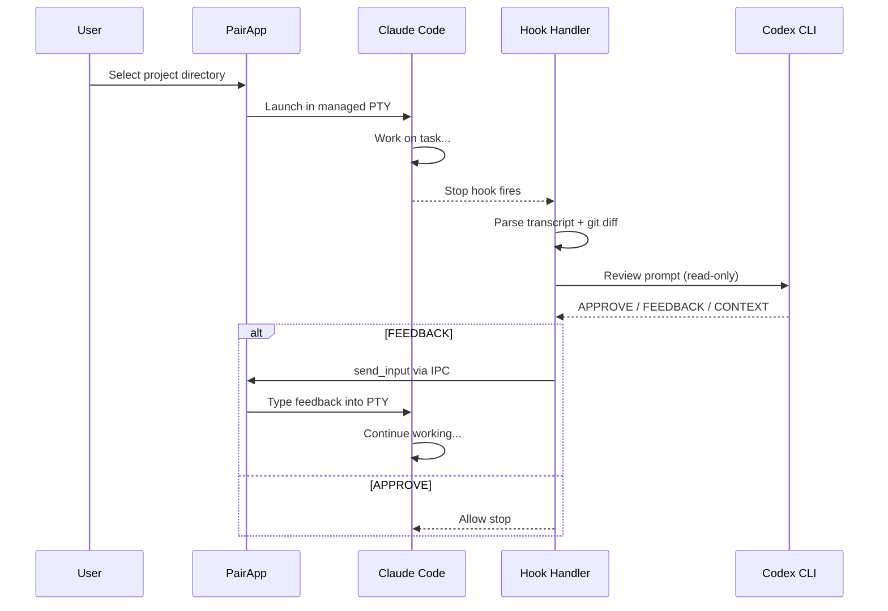
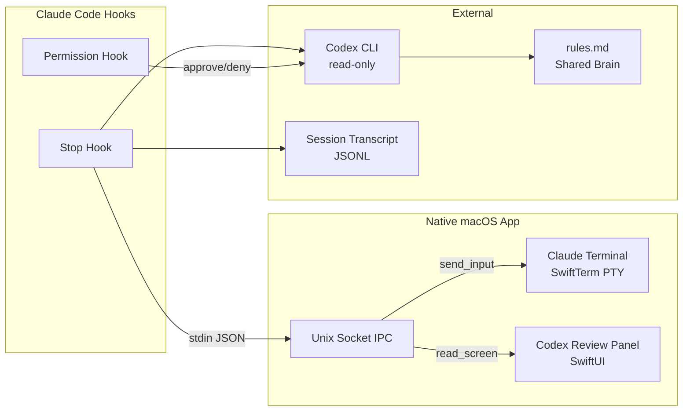

<p align="center">
  
</p>

<h1 align="center">Pair — Claude + Codex</h1>

<p align="center">
  Native macOS app that pairs Claude Code with OpenAI Codex for autonomous code review and task completion.<br/>
  <sub>Requires macOS 14 (Sonoma) or later · Apple Silicon (ARM64)</sub>
</p>

<p align="center">
  <a href="https://github.com/ytspar/claude-codex-pair/releases">Download</a> · <a href="#how-it-works">How it Works</a> · <a href="#install">Install</a>
</p>

---

When Claude Code pauses (completes a task or asks a question), Codex reviews the modified files and Claude's output, then decides: **approve**, **provide feedback**, or **request context**. Claude receives the feedback as direct terminal input and continues working. Codex acts as the human operator — answering questions, choosing options, and pushing back on shortcuts.

## How It Works





## Features

- **Split-pane window** — Claude Code terminal (left) + Codex review panel (right)
- **Completion gate** — Codex reviews when Claude pauses, blocks until task is truly done
- **Direct input injection** — Codex types into Claude's terminal via PTY (no clipboard hacks)
- **Multi-session tabs** — Run multiple Claude sessions, Cmd+1-9 to switch
- **Project picker** — Scans ~/git for repos, shows recent projects with timestamps
- **Auth check** — Verifies Claude + Codex authentication on launch (API key + subscription)
- **Theme support** — Devbar emerald theme or user's Ghostty config colors (Cmd+T)
- **Departure Mono** — Retro pixel terminal typography throughout
- **Scratchpad** — Draft multi-line prompts without accidentally sending
- **read_screen** — Codex reads Claude's terminal output as plain text
- **Shell integration** — ZDOTDIR injection for zsh environment setup
- **Shared rules.md** — Claude and Codex align on project conventions
- **GhosttyKit ready** — Metal GPU rendering framework built (optional upgrade)

## Prerequisites

- macOS 14+
- [Claude Code](https://docs.anthropic.com/en/docs/claude-code) installed and authenticated
- [Codex CLI](https://github.com/openai/codex) installed and authenticated
- Node.js >= 22

## Install

### Download (macOS ARM64)

Download `pair-v0.1.0-macos-arm64.zip` from [Releases](https://github.com/ytspar/claude-codex-pair/releases), unzip, move `Pair.app` to Applications.

### Build from source

```bash
git clone https://github.com/ytspar/claude-codex-pair
cd claude-codex-pair/app/PairApp
swift build -c release
# Binary at .build/release/PairApp
```

### CLI tools (optional)

```bash
cd claude-codex-pair
npm install
npm run build
npm link
# Provides: pair start, pair stop, pair status, pair review, pair report, pair config
```

## Usage

Launch the app → auth check → pick a project → Claude starts with Codex watching.

| Shortcut | Action |
|----------|--------|
| **⌘N** | New session (directory picker) |
| **⌘W** | Close current session |
| **⌘1-9** | Switch between sessions |
| **⌘T** | Toggle Devbar / Ghostty theme |
| **⌘⇧W** | Close window |

### CLI

```bash
pair launch ~/my-project    # Open PairApp with a Claude session
pair start                  # TUI monitor (install hooks, watch all sessions)
pair review                 # One-shot Codex review of current diff
pair report                 # Markdown report of session interactions
pair config show            # Show configuration
```

## Configuration

Config at `~/.claude-codex-pair/config.json`:

| Key | Default | Description |
|-----|---------|-------------|
| `maxCycles` | `5` | Max review cycles before auto-approve |
| `codexModel` | `null` | Override Codex model (null = default) |
| `codexTimeout` | `300000` | Codex call timeout in ms |
| `logDir` | `~/.claude-codex-pair/sessions` | Session log directory |
| `targetSessions` | `null` | Only review these sessions/projects |

## Architecture

```
app/PairApp/          # Native macOS app (Swift, SwiftUI, SwiftTerm)
├── PairWindowView    # Split layout: terminal + Codex panel
├── SessionManager    # Multi-session PTY management
├── CodexPanelView    # Review status, feedback, history
├── ScratchpadView    # Draft prompts before sending
├── IPCServer         # Unix socket (send_input, read_screen, send_key)
├── AuthChecker       # Claude + Codex auth verification
├── ThemeManager      # Devbar / Ghostty color switching
├── GhosttyConfig     # Parse ~/.config/ghostty/config
├── ShellIntegration  # ZDOTDIR trick for zsh
└── GhosttyBridge     # Optional Metal GPU rendering

src/                  # Node.js hook system
├── monitor/
│   ├── hook-handler  # Stop hook → Codex review → feedback
│   ├── permission-handler  # Codex-gated tool approval
│   └── transcript    # Parse Claude JSONL transcripts
├── codex/
│   ├── client        # Spawn codex exec --json (streaming)
│   └── prompt-builder # Review + respond prompts
└── shared/
    ├── pair-terminal # IPC client for PairApp
    └── rules.md      # Shared Claude↔Codex alignment
```

## Safety

- **Codex is read-only** — `codex exec -s read-only`, can never modify files
- **Max cycle limit** — prevents infinite feedback loops (default 5)
- **Graceful degradation** — Codex errors auto-approve, never block Claude
- **Socket permissions** — IPC restricted to current user (`chmod 0o600`)
- **No telemetry** — no analytics, no network calls beyond Claude/Codex CLIs

## License

MIT — Copyright (c) 2026 Yury Tspar
